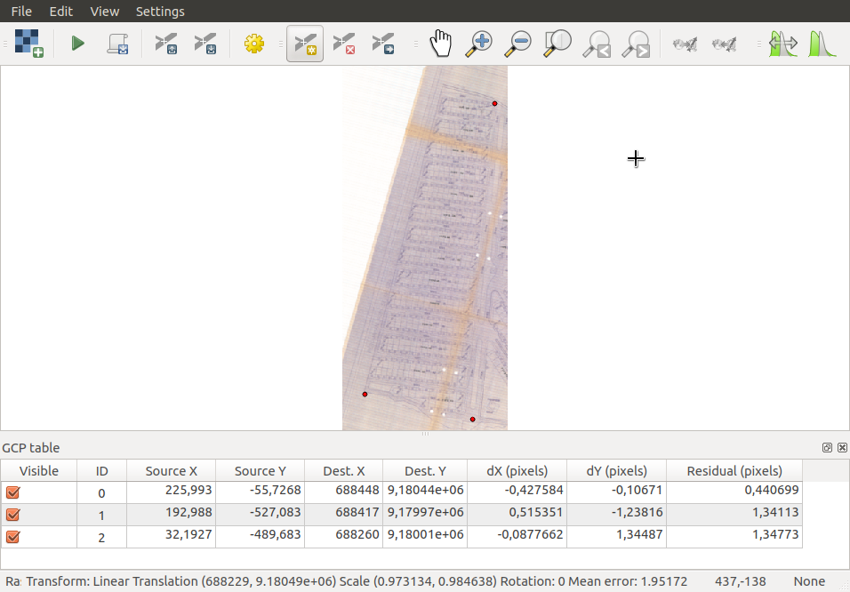
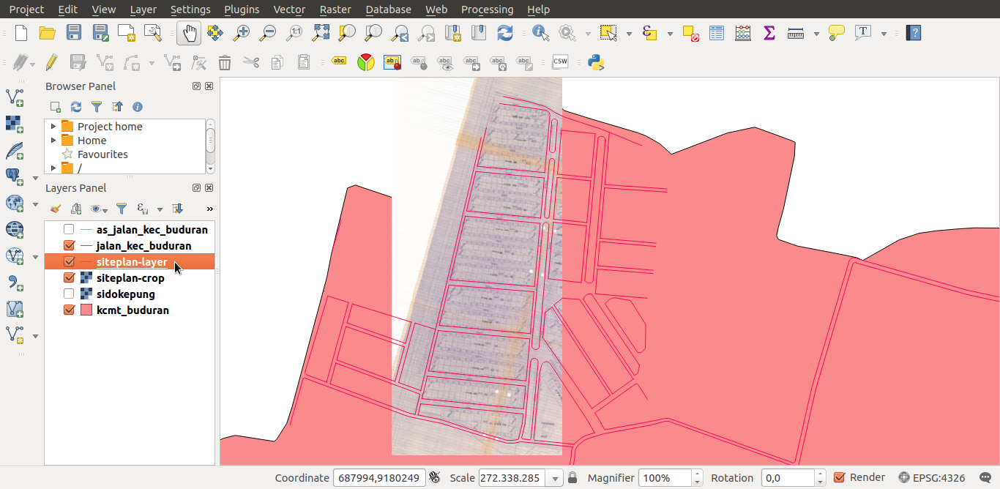

# Siteplan Geo-referencing & Digitizing

#### Cahya Putra Hikmawan - 05111540000119

##### Best Documentation on https://github.com/cphikmawan/geographic-information-system-courses

### Contents
[1. Materials](#materials)

[2. Geo-referencing with Google Maps](#geo-referencing-with-google-maps)

[3. Geo-referencing with Siteplan Maps](#geo-referencing-with-siteplan-maps)

[4. Siteplan Digitizing](#siteplan-digitizing)

### Materials
- **Siteplan**
[PT. Megatopmas Nusantara - Surya Asri - Sidokepung - Sidoarjo](assets/img/30.PT.MEGATOPMASNUSANTARASURYAASRIDSSIDOKEPUNG.tif)
- **Cropped Siteplan**
[Cropped Siteplan](assets/img/siteplan-crop.png)
- **Vector File**
[Kecamatan Buduran](assets/kec-buduran)
- **QGIS Project File**
[QGIS Project](assets/saved-files)

### Geo-referencing with Google Maps
#### Step 1 - Open QGIS Applications

#### Step 2 - Open Vector Image on QGIS
- How to open vector image?
1. - Click on red circle describe on image below :
    
    - then **browse** *__.shp__* files and open it
    
    

    - set *__Coordinate Reference System WGS 84__* then click **ok**

    

    - then vector has loaded on QGIS

    

2. Make it easy with drag and drop all file *__.shp__*. then only check *kcmt_buduran.shp* and *jalan_kec_buduran.shp*

#### Step 3 - Screenshot Image on Google Maps
1. In this part, i will take screenshot on **Desa Sidokepung**, like image below:

#### Step 4 - Geo-referencing with GMaps Image
- How to geo-referencing?
1. Make image more detail with zoom in on Vector Image **Kecamatan Buduran** only in **Desa Sidokepung** area.

2. Open QGIS Georeference tools placed on **Raster Menu**

3. Open screenshot images from **Step 3**, also use **WGS 84**.

4. Tag a point on **Raster Image** and **Vector Image**, in this case i just tagged 4 points (miminum 3 points). and get mean error *__0.595726__*, when tag point in this step, get minimum mean error.
    - After tag points, then start Georeferencing

    

#### Step 5 - Done

### Geo-referencing with Siteplan Maps
Step for geo-referencing with siteplan same with 5 step before.
#### Step 1 - Open QGIS georeference on Raster Menu
#### Step 2 - Open the siteplan TIF images
FYI : Because the siteplan is perfectly detailed and has differrent rotation, in this part i need to crop and rotate 15 Degree the siteplan image like this:

#### Step 3 - Tag points

- In this case i tagged 3 points and get mean error *__1.95172__*

#### Step 4 - Georeferencing the Siteplan

#### Step 5 - Done

### Siteplan Digitizing
How to digitizing?
#### Step 1 - Create New Layer
1. Click **Layer Menu -> Create Layer -> New Shapelayer** or **CTRL+Shift+N**

2. Add Name to the new layer and choose **Line Type** then **OK -> Save**

3. Layer Created

#### Step 2 - Toggle Edit on Layer
1. Click Toggle Edit and Add Feature

2. Draw Pattern like Siteplan Image that already Geo-refenrenced like this

#### Step 3 - Save Layer & Show. Done!

###### Created with <3 by Cloudy