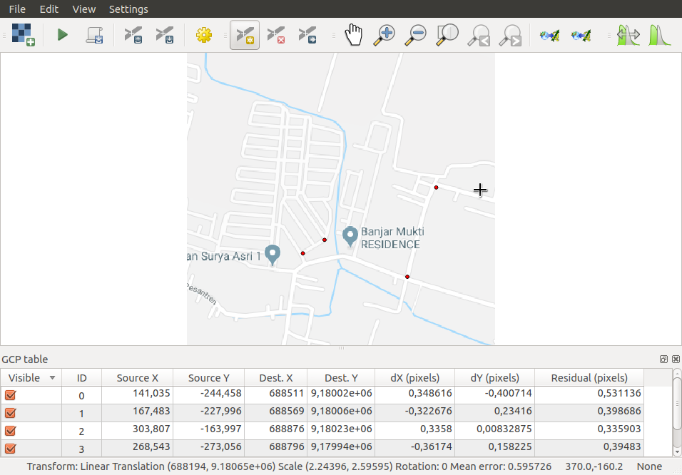

# Siteplan Geo-referencing & Digitizing

### Contents
[1. Materials](#materials)

[2. Geo-referencing with Google Maps](#geo-referencing-with-google-maps)

[3. Geo-referencing with Siteplan Maps](#geo-referencing-with-siteplan-maps)

[4. Siteplan Digitizing](#siteplan-digitizing)

### Materials
- **Siteplan**
[PT. Prima Cahya Budi Anugrah - Taman Anggrek Regency - Jati - Sidoarjo](assets/img/siteplan-perumahan-taman-anggrek-desa-jati-sidoarjo.tif)
- **Vector File**
[Kecamatan Sidoarjo](assets/kecamatan-sidoarjo-shp)

### Geo-referencing with Google Maps
#### Step 1 - Open QGIS Applications

#### Step 2 - Open Vector Image on QGIS
- How to open vector image?
1. - Click on red circle describe on image below :
    
    - then **browse** *__.shp__* files and open it
    
    

    - set *__Coordinate Reference System WGS 84__* then click **ok**

    

    - then vector has loaded on QGIS

    

2. Make it easy with drag and drop all file *__.shp__*. then only check *kcmt_sidoarjo.shp* and *jalan_kec_sidoarjo.shp*

#### Step 3 - Screenshot Image on Google Maps
1. In this part, i will take screenshot on **Desa Jati**, like image below:

#### Step 4 - Geo-referencing with GMaps Image
- How to geo-referencing?
1. Make image more detail with zoom in on Vector Image **Kecamatan Sidoarjo** only in **Desa Jati** Areas (Inside Red Rectangle).

2. Open QGIS Georeference tools placed on **Raster Menu**

3. Open screenshot images from **Step 3**, also use **WGS 84**.

4. Tag a point on **Raster Image** and **Vector Image**, in this case i just tagged 4 points (miminum 3 points). and get mean error *__0.938882__*, when tag point in this step, get minimum mean error.
    - After tag points, then start Georeferencing

    

#### Step 5 - Done

### Geo-referencing with Siteplan Maps

### Siteplan Digitizing

##### Best Documentation on https://github.com/cphikmawan/geographic-information-system-courses
###### Created with <3 by Cloudy