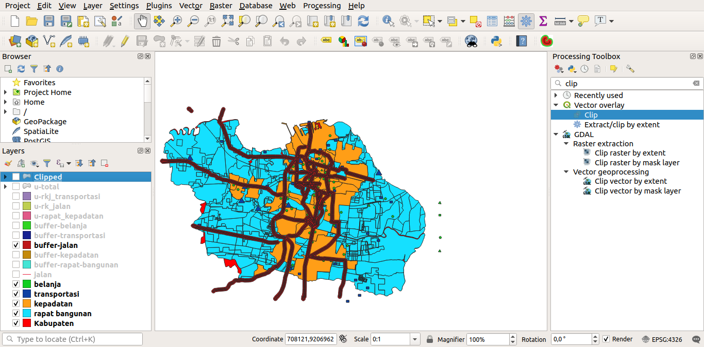

# Spatial Analysis for the Selection of Locations of Multi-storey Central Parking in Surabaya

#### Cahya Putra Hikmawan - 05111540000119

##### Best Documentation on https://github.com/cphikmawan/geographic-information-system-courses

### Contents
[1. Materials](#1-materials)

[2. Load Vector Data](#2-load-vector-data)

[3. Install Plugins and Create Buffer](#3-install-plugins-and-create-buffer)

[4. Union Each Buffer](#4-union-each-buffer)

[5. Clip Buffer](#5-clip-buffer)

### 1. Materials
- **Vector Data That Needed**
[Here The Vector Data](assets/material/)

### 2. Load Vector Data
#### Step 1 - Drag and drop or load the vector data to **_layers_**

### 3. Install Plugins and Create Buffer
#### Step 1 - Install **Multi-distance Buffer**
- In the **menu** select plugins
- Type **_search_** **multi-distance buffer**
- Then **install** plugins

#### Step 2 - Create Buffer
- Make Decision Value For Each Vector Data
    1. Rapat Bangunan

    | Area Cakupan | Skor |
    | --- | --- |
    | 100 Meter | 1 |
    | 250 Meter | 2 |
    | 500 Meter | 3 |

    2. Kepadatan

    | Kepadatan(jumlah penduduk) | Skor |
    | --- | --- |
    | 100 | 1 |
    | 250 | 2 |
    | 500 | 3 |

    3. Transportasi

    | Area Cakupan | Skor |
    | --- | --- |
    | 200 Meter | 1 |
    | 100 Meter | 2 |
    | 50 Meter | 3 |

    4. Belanja

    | Area Cakupan | Skor |
    | --- | --- |
    | 200 Meter | 1 |
    | 100 Meter | 2 |
    | 50 Meter | 3 |

    5. Jalan

    | Area Cakupan | Skor |
    | --- | --- |
    | 200 Meter | 1 |
    | 100 Meter | 2 |
    | 50 Meter | 3 |

- **Create** The Buffer Each Buffer

    Example: Create Jalan Buffer
    1. Open Multi-Distance Buffer
        
    2. Select Layer -> Add Value -> Ok -> Close
        
    3. The Result
        

- After create buffer and get **result** like this
    

- Then **Edit** Score Value

    Example: Edit Score Value on Jalan Buffer
    1. **Right Click** on The Buffer -> **Open Attribute Table**
        
    2. **Toggle Editing Mode** (Click on Pencil Icon)

        - **Delete Inner Column**

            

        - **Add Score Column and Add the Value**

            

>**Dont forget to save each created buffer**

### 4. Union Each Buffer

- On The **Menu** select **_Processing_** -> **_Toolbox_**
- Search **union**

#### Step 1 - Union Buffer *Rapat Bangunan & Kepadatan*

#### Step 2 - Union Buffer Pada *Step 1 & Buffer Jalan*

#### Step 3 - Union Buffer Pada *Step 2 & Buffer Transportasi*

#### Step 4 - Union Buffer Pada *Step 3 & Buffer Belanja*

#### Step 5 - *Open* Attribute Table -> *Edit* empty field with *"0"* Value

#### Step 6 - *Open* Calculator

1. Fill **output field name**
2. Then Choose **fields and values**
3. Then Double Click on **score**
4. Click **Plus Notation "+"**
5. And click **score_2**, then repeat until **score_5**.

6. It will look like this.

    

7. Ok. it will create column named **total**

    

#### Step 5 - Set the Color

1. Right Click -> **Properties**
2. Edit from **Single Symbol** to **Categorized**
3. Select column to **total**
4. Optional (Select Symbol) -> Im not doing this
5. Select **color ramp** for gradation color

#### Union Result
- Total Screenshot

- Zoom In Screenshot

### 5. Clip Buffer

> **Because the union buffer offside from the base layer (kabupaten),**
> **We need to Clip the Union Buffer**
- On The **Menu** select **_Processing_** -> **_Toolbox_**
- Search **clip**

**1. Input Layer -> union layer from all buffer**

**2. Overlay Layer -> The main layer (kabupaten)**

**3. Clipped -> Save Clip**

**4. Run**

### Conclusion

| Value | Rate |
| --- | --- |
| 1 - 3 | Bad |
| 4 - 6 | Common |
| 7 - 9 | Enaugh |
| 10 - 11 | Best |

###### Created with <3 by Cloudy